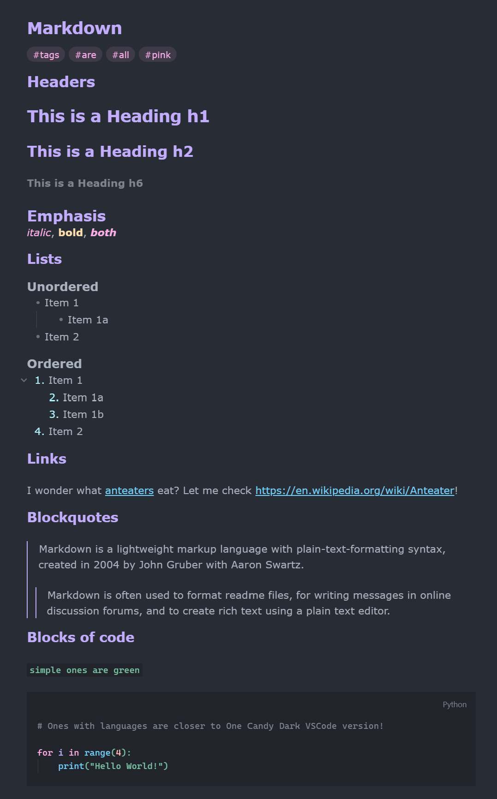

# One Candy Dark for Obsidian

a pastel pink-and-purple dark theme for obsidian. based on the lovely theme [One Candy Dark](https://github.com/KacperBiedka/OneCandy) by
[Kacper Biedka](https://github.com/KacperBiedka), which is based on One Dark Pro.

## Install

not in obsidian's theme library yet. 

1. Download `theme.css` and `manifest.json` from this repo.
2. In your vault, create a folder at `.obsidian/themes/One Candy Dark/`.
3. Put both files inside it.
4. In Obsidian, go to **Settings → Appearance → Themes** and pick **One Candy Dark**.

## Notes

- dark mode only for now
- no mermaid diagrams yet